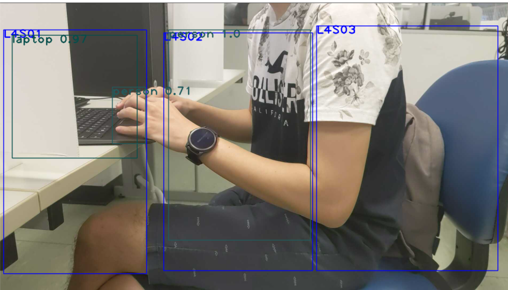

## Object Detection system with FireStore
This is an object detection system that perform inference on user defined spots( multiple small images cropped from the full picture ) on live feed video from mobile phone using [IP Webcam](https://play.google.com/store/apps/details?id=com.pas.webcam&hl=en_SG&gl=US) or any ip camera. It will then update the result to firebase.

**Application**:
\
Detect whether the seats in library are occupied or hogged by the user (specified object detected for more than 5s, for this project, it's bottle). The seats information (which camera detect it, bounding box of the seat location in the camera ) will be recorded on firebase.
&nbsp;

**Hardware**: 
1. Any Phone with camera
2. CPU

**Language**: 
1. Python
&nbsp;
## Dependencies
1. opencv 4.5.1
2. firebase-admin 4.5.2

## Installation
```bash
1.gitclone this repo.

2.setup your firestore. this repo will just get the documents that has the specified CAMERA_ID. Must include the key of document as id in each document.

3.download yolov3.weights from official website or https://pjreddie.com/media/files/yolov3-tiny.weights and put it inside this folder

```
modify "CAMERA_IP", "CAMERA_ID","FIRESTORE_COLLECTION" to your respective camera.

&nbsp;

## How to Run?
1. python Detection.py_k

&nbsp;

## TODO
- [X] Set up firestore to update status 
- [X] Crop images from defined top left and bottom right corner from the document retrieve from firestore. 
- [X] read live stream image from an IP Camera
- [X] support multiple camera
- [ ] Trained a custom model to detect for specific application


&nbsp;

## Remarks
The yolo inference is modified from this [repo](https://github.com/DhrumilParikh-github/ObjectDetection-without-GPU)


Multicamera mode does not support showing the output frame.
&nbsp;
### Some images to illustrate the application


The example of the data stored in the firestore. \
cameraId: camera that is capturing this seat. \
x1Img,y1Img : top left of the bounding box \
x2Img,y2Img : bottom right of the bounding box

&nbsp;


The example of the detected frame. Each blue bounding box is referred to a seat labeled by user. In this application, the labeled part will be cropped out and inferred in batch. 

